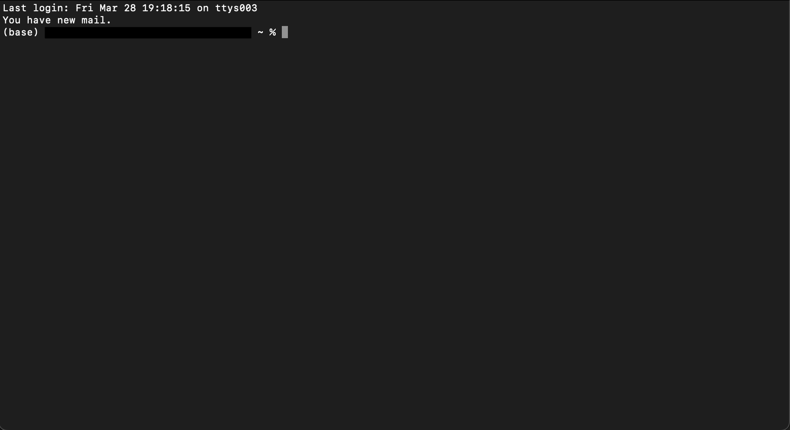
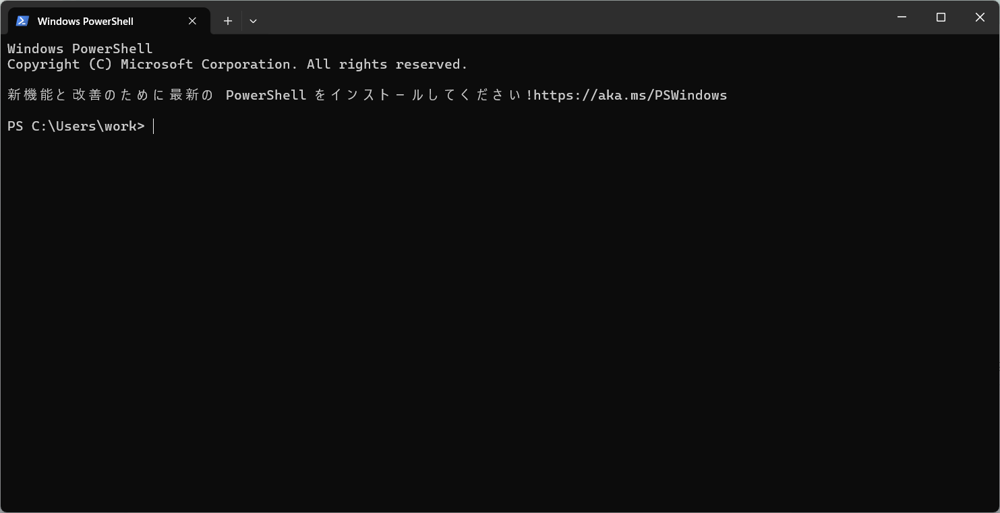

# MySQLのセットアップ方法
 
## 1. ソースコードをダウンロードする

### Macユーザの方
1. 「Hey Siri」と話しかけて、「ターミナルを開いて」と指示します。
2. 問題がなければ、下の画像のようにターミナルが起動します。
3. ターミナルに以下のコマンドを入力し、Enterキーを押して実行します。

    ```console
    git clone https://github.com/rspharada/mysql.git
    ln -s "$(pwd)/mysql" ~/Desktop/mysql
    ```

### Windowsユーザの方
1. Windowsキー + R を同時に押します（「ファイル名を指定して実行」ウィンドウが開きます）
2. 「powershell」と入力し、Enterキーを押します
3. PowerShell が開きます！
4. PowerShell の画面で、以下のコマンドを入力し、Enterキーを押して実行します

    ```console
    git clone https://github.com/rspharada/mysql.git
    ```

## 2. Docker Desktopをインストールする
下記のサイトからDocker Desktopをインストールします。  
https://www.docker.com/ja-jp/products/docker-desktop/

対応するOSを選択して、インストールをしてください。

## 3. MySQLをセットアップ&MySQLに接続する

### Macユーザの方
1. ターミナルに以下のコマンドを入力し、Enterキーを押して実行します
    ```console
    cd ~/Desktop/mysql
    docker compose up -d
    ```

2. 下記のコマンドを実行し、MySQLへ接続します。
    ```console
    docker compose exec -it mysql  mysql -u root -p 

    Enter password: ここで「root」と入力してEnterキーを押します。
    ```

3. 実行後、成功すれば下記のメッセージが表示されます。
    ```
    Welcome to the MySQL monitor.  Commands end with ; or \g.
    Your MySQL connection id is 8
    Server version: 8.0.41 MySQL Community Server - GPL

    Copyright (c) 2000, 2025, Oracle and/or its affiliates.

    Oracle is a registered trademark of Oracle Corporation and/or its
    affiliates. Other names may be trademarks of their respective
    owners.

    Type 'help;' or '\h' for help. Type '\c' to clear the current input statement.

    mysql>
    ```

4. 試しにデータベースが存在すルカ確認してみましょう。下記のコマンドを実行して、データベースが以下のように表示されていれば成功です。
    ```cinsole
    show databases;
    ````

    上記のコマンドを実行した結果↓
    ```console
    +--------------------+
    | Database           |
    +--------------------+
    | information_schema |
    | mysql              |
    | performance_schema |
    | sys                |
    | training_db        |
    +--------------------+
    5 rows in set (0.06 sec)
    ```


### Windowsユーザの方
1. パワーシェルで以下のコマンドを入力し、Enterキーを押して実行します
    ```console
    cd mysql
    docker compose up -d
    ```

2. 下記のコマンドを実行し、MySQLへ接続します。
    ```console
    docker compose exec -it mysql  mysql -u root -p 

    Enter password: ここで「root」と入力してEnterキーを押します。
    ```

3. 実行後、成功すれば下記のメッセージが表示されます。
    ```
    Welcome to the MySQL monitor.  Commands end with ; or \g.
    Your MySQL connection id is 8
    Server version: 8.0.41 MySQL Community Server - GPL

    Copyright (c) 2000, 2025, Oracle and/or its affiliates.

    Oracle is a registered trademark of Oracle Corporation and/or its
    affiliates. Other names may be trademarks of their respective
    owners.

    Type 'help;' or '\h' for help. Type '\c' to clear the current input statement.

    mysql>
    ```